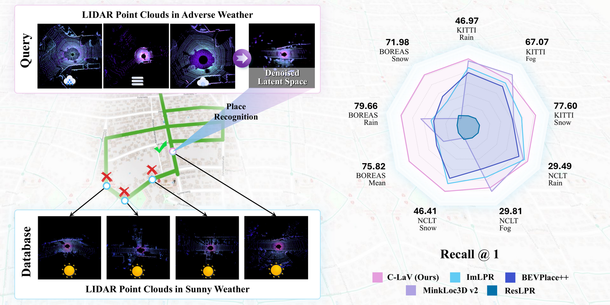

# C-LaV: Conditional Latent Velocity Field Denoising for Weather-Robust LiDAR Place Recognition

**CVPR 2026**

[Xuewei Cao](mailto:caoxuewei@mail.ustc.edu.cn)¹,² ·
[Jiayue Yang](mailto:jiayueyang@mail.ustc.edu.cn)¹,² ·
[Zhiwen Zeng](mailto:20220665@stu.cqu.edu.cn)¹,² ·
[Yanyong Zhang](mailto:yanyongz@ustc.edu.cn)¹,² ·
[Yan Xia](mailto:yan.xia@ustc.edu.cn)¹,²&dagger;

¹School of Artificial Intelligence and Data Science, University of Science and Technology of China &nbsp;·&nbsp;
²Suzhou Institute for Advanced Research, USTC &nbsp;·&nbsp; &dagger;Corresponding author

[](https://patience-joey.github.io/clav/)
[](https://huggingface.co/xueweicao/clav)
[](LICENSE)

<p align="center">
  
</p>

> **Abstract.** LiDAR-based place recognition is highly sensitive to rain, snow, and fog, where scattering and attenuation distort geometric structure and intensity. We tackle this problem with **Conditional Latent Velocity Field (C-LaV) denoising**, which restores weather-robust representations *before* retrieval. Single-sweep point clouds are projected into three-channel bird's-eye-view (BEV) images and encoded with a frozen DINOv2-based BEV transformer to obtain a semantically anchored latent space shared across weather conditions. On this manifold, a conditional Flow-Matching model learns a velocity field whose probability-flow ODE deterministically transports noisy latents toward their clear-weather counterparts. From the denoised manifold, a Sinkhorn Aggregation of Local Descriptors (SALAD) head produces compact global descriptors optimised with a truncated Smooth-AP loss. We also establish a unified adverse-weather benchmark with 3 m frame spacing and shared evaluation thresholds across KITTI, NCLT, and Boreas. Our C-LaV improves Recall@1 by **17.5%** on NCLT snow and **21.5%** on Boreas, achieving state-of-the-art weather robustness.

For the full method, results, and an interactive demo, see the **[project page](https://patience-joey.github.io/clav/)**.

## Quick start

```bash
git clone https://github.com/Patience-Joey/clav.git && cd clav

# Pre-trained weights
python -c "
from huggingface_hub import hf_hub_download
for ds in ('kitti','nclt','boreas'):
    for f in ('stage2.pt','best.pt'):
        hf_hub_download('xueweicao/clav', f'{ds}/{f}', local_dir='results/cvpr_repro')
"

# Evaluate (KITTI / NCLT / Boreas)
bash scripts/eval/evaluate_kitti.sh  --checkpoint results/cvpr_repro/kitti/best.pt
```

Training scripts live in `scripts/train/`; dataset preparation in `data_pre/`.

## Citation

```bibtex
@inproceedings{cao2026clav,
  title     = {C-LaV: Conditional Latent Velocity Field Denoising for Weather-Robust LiDAR Place Recognition},
  author    = {Cao, Xuewei and Yang, Jiayue and Zeng, Zhiwen and Zhang, Yanyong and Xia, Yan},
  booktitle = {Proceedings of the IEEE/CVF Conference on Computer Vision and Pattern Recognition (CVPR)},
  year      = {2026}
}
```

## License

Released under the [MIT License](LICENSE).

## Acknowledgments

We build on excellent prior work — [DINOv2](https://github.com/facebookresearch/dinov2),
[SALAD](https://github.com/serizba/salad),
[BEVPlace++](https://github.com/zjuluolun/BEVPlace),
[ImLPR](https://github.com/minwoo0611/ImLPR),
the fog/snow simulators of [Hahner et al.](https://github.com/MartinHahner/LiDAR_fog_sim),
and the [Boreas](https://www.boreas.utias.utoronto.ca/) dataset team.
We thank our colleagues at USTC and the Suzhou Institute for Advanced Research for valuable discussions.
